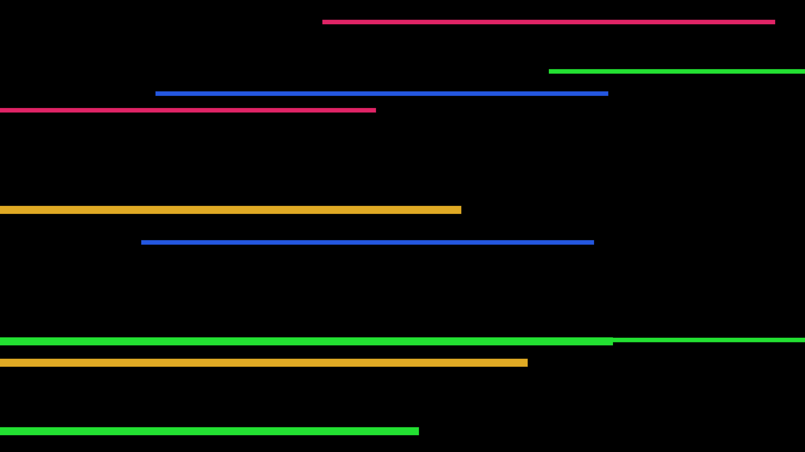
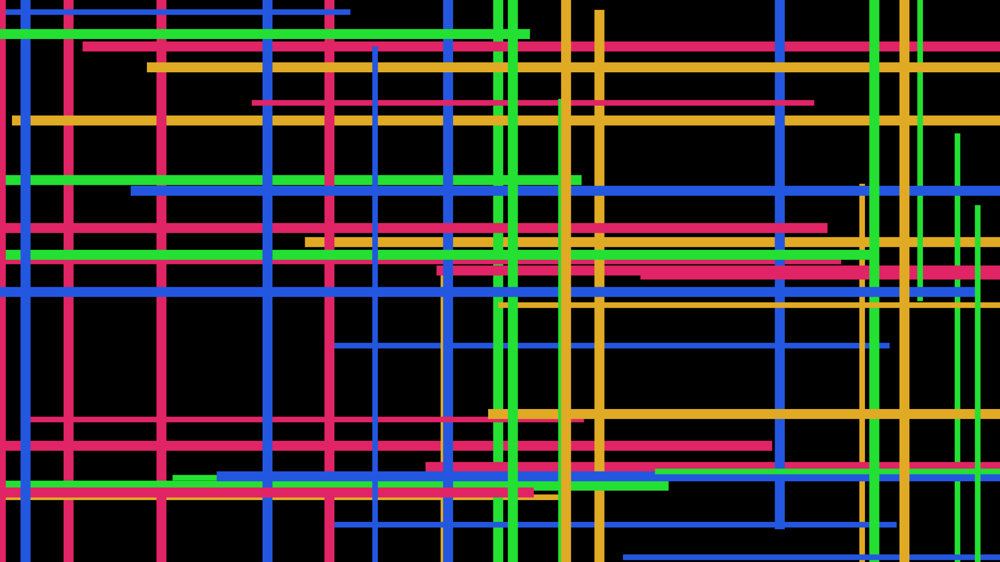
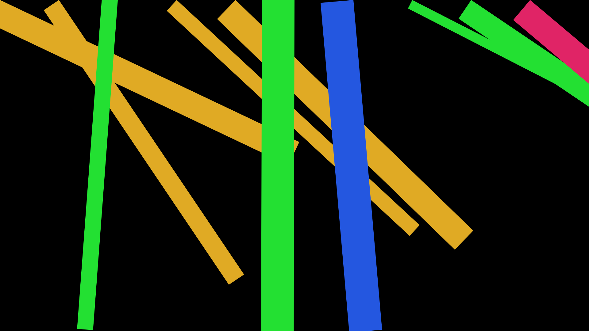

# Bars log

My goal is to generate abstract art based on a lines/bars like in a set of "brush strokes".

## STEP ONE:

Simply draw rectangles for "bruch strokes".

Commit [150fd8f](https://github.com/nigini/p5js-playpen/commit/150fd8f204d9358b0df11dc0509fbf5e926a6c09) draws something like this:

## STEP TWO:

Play with angles... Let us start with 0/90 to begin with, as this will look more like the grid I want to get to.

Commit [c99873b](https://github.com/nigini/p5js-playpen/commit/c99873b549326771167700a3c7734a26f747019a) draws something like this:

## STEP THREE:

Play with angles and dimensions... I wanted to see if this can express interesting movement through superposition.

Commit [0eec5e0](https://github.com/nigini/p5js-playpen/commit/0eec5e06b7496383985c8a1f5bb18c84df4c79aa) draws something like this:

