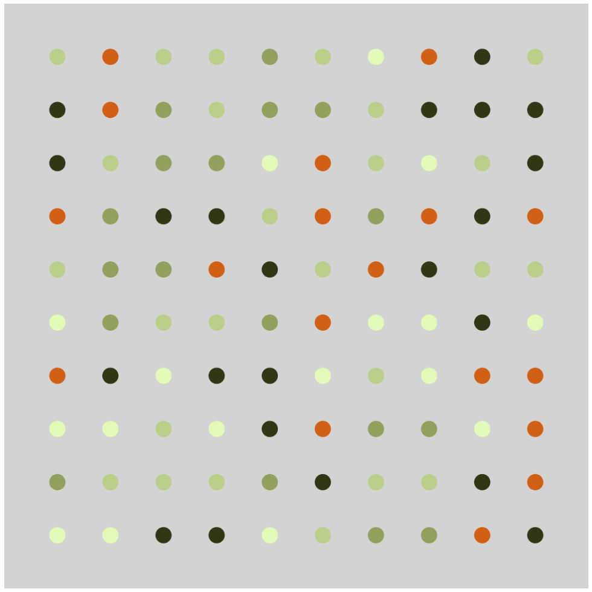

# Grids log

My goal is to experiment with generate abstract art based on a grid of connected points.

## STEP ONE:

Generate the grid based on a set dimension and show the points. [**DONE!**](https://github.com/nigini/p5js-playpen/commit/204a35e66362a2e938a89d695f8225392546c01f)

## STEP TWO:

Play with dots properties, like fill color, size, and maybe board color. **DONE!**

*Interesting goal*: use some nice distribution function to creat nice color patters.

## STEP THREE:

Play with dots connections.
