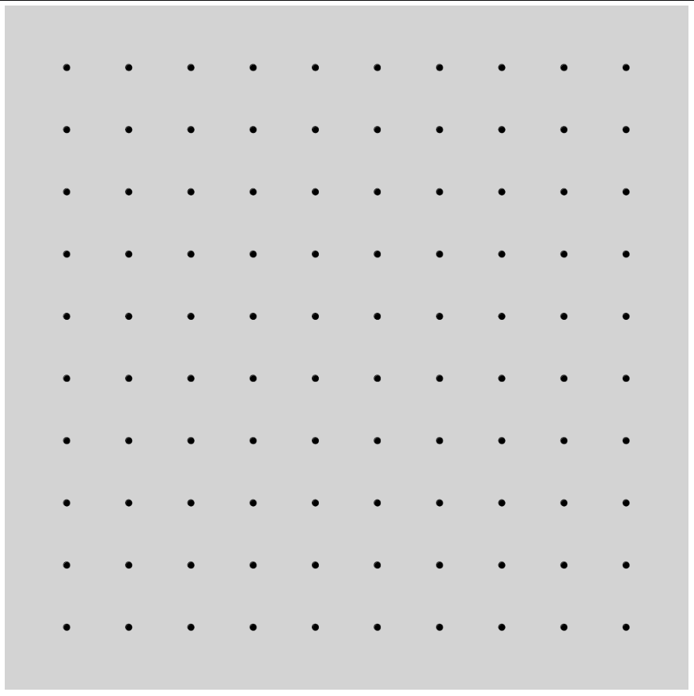

# Grids log

My goal is to experiment with generate abstract art based on a grid of connected points.

## STEP ONE:

Generate the grid based on a set dimension and show the points.

## STEP TWO:

Play with dots connections.
